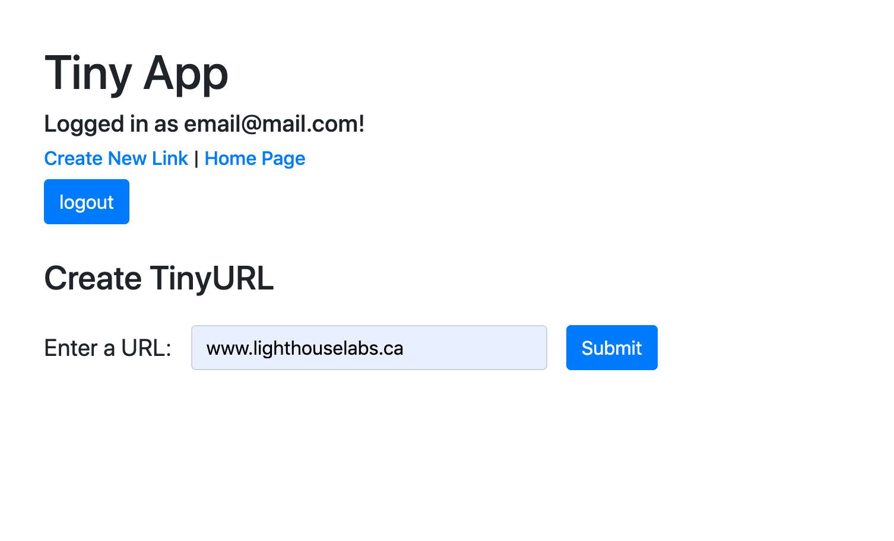
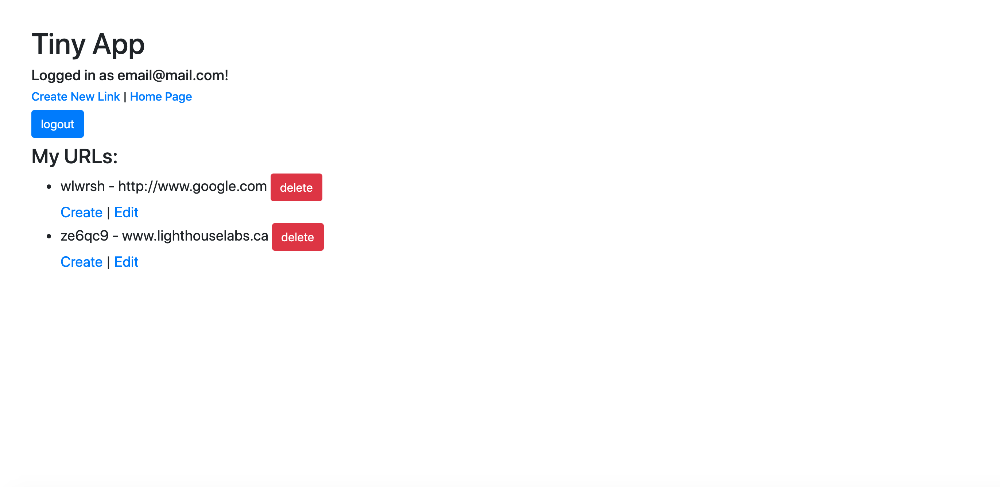

# Tiny App Project

    Tiny App is a full stack application built for shortening long URLs using Express and Node.

## Final Product

    

    
    

## Dependencies

    - Node.js
    - Express
    - EJS
    - bcrypt
    - body-parser
    - cookie-session

##  :+1: Getting Started

    - Install all npm dependencies (using the `npm install` command).
    - Run the development server using the `node express_server.js` command.
